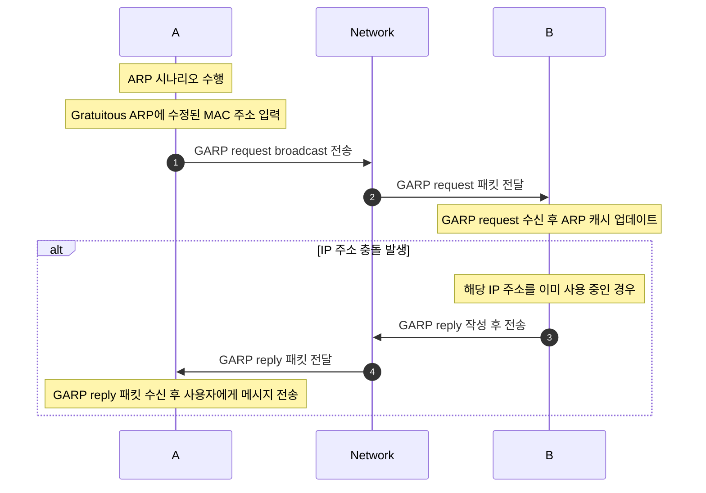

# 2023CN_ARPWithMFC

# 실습 시나리오
1. ARP 시나리오 그대로
2. HostA는 Gratuitous ARP란에 수정된 MAC 주소를 입력한다.
3. HostA에서 GARP request를 broadcast로 전송한다.(이 요청에는 출발지의 MAC 주소와 IP 주소, 그리고 목적지의 MAC 주소와 IP 주소가 모두 자신의 것으로 설정되어있음)
4. 이 요청을 수신한 모든 장치(== HostB)는 자신의 ARP 캐시를 업데이트한다.
5. 만약 장치가 이미 해당 IP 주소를 사용하고 있었다면, (== IP 주소 충돌) 이 경우, 해당 장치는 이를 충돌로 인식하고 출발지)에게 GARP reply을 작성한다.
6. HostA에서 GARP reply 패킷을 받았으면 사용자에게 메시지를 보낸다.

## 실습 시나리오 시퀀스 다이어그램

# 프로토콜 스택

  
