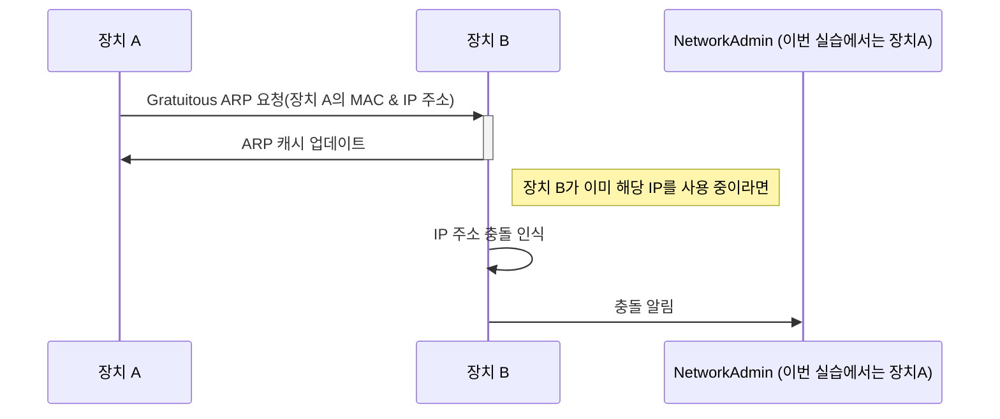

# 2023CN_ARPWithMFC

# 실습 시나리오
1. 두 대의 PC에서 각각 프로그램을 실행한다.
2. 두 대의 PC는 같은 네트워크로 연결한다. (같은 WIFI)
3. 장치 A는 Gratuitous ARP 요청을 브로드캐스트로 전송한다. (이 요청에는 출발지의 MAC 주소와 IP 주소, 그리고 목적지의 MAC 주소와 IP 주소가 모두 자신의 것으로 설정되어있음)
4. 이 요청을 수신한 모든 장치는 자신의 ARP 캐시를 업데이트한다.
5. 만약 장치가 이미 해당 IP 주소를 사용하고 있었다면, (== IP 주소 충돌) 이 경우, 해당 장치는 이를 충돌로 인식하고 네트워크 관리자(== 출발지)에게 알린다.

## 실습 시나리오 시퀀스 다이어그램

# 프로토콜 스택

  
