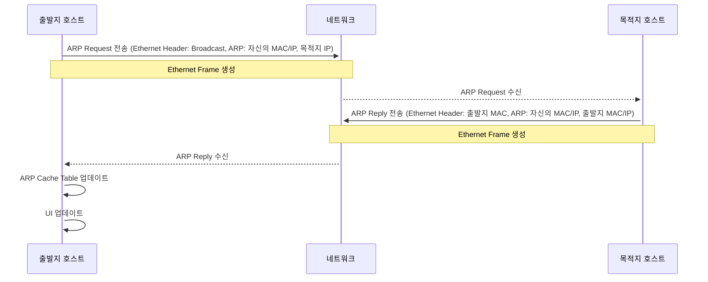

# 2023CN_ARPWithMFC

# 실습 시나리오
1. 두 대의 PC에서 각각 프로그램을 실행한다.
2. 두 대의 PC는 같은 네트워크로 연결한다. (같은 WIFI)
3. ARP Request 및 Reply를 받을 NIC를 선택 및 개방한다.
4. 출발지 호스트에서 전송 버튼을 누른다. 
	- ARP cache table에 IP address, MAC address, status를 확인한다.
5. ARP Request 패킷을 작성한다.
	- Hardware Type은 1
	- Protocol Type은 0x0800(IP)
	- Opcode를 1(ARP Request)
	- Sender영역에 자신의 MAC 주소와 IP 주소 설정한다.
	- Target영역에 Hardware는 0으로 protocol address는 목적지 IP주소로 설정한다.
6. Ethernet헤더를 작성한다.
	- Ethernet Header의 Destination Address를 Broadcast 주소로 채운다.
	- Ethernet Header의 Source Address를 자신의 MAC 주소로 채운다.
	- Ethernet Type을 0x0806(ARP)로 설정한다.
7. 레이어 아키텍처에 의해서 Encapsulated Packet(==Ethernet frame)이 생성된다.
8. NI Layer의 pcap라이브러리로 작성된 코드로 packet은 네트워크로 전송된다.
9. OnTimer를 설정(180초)한다.
10. 목적지 호스트에서 패킷(Request)을 수신한다.
	- Ethernet Layer에서 목적지 MAC 주소가 broadcast인지 확인한다.
		- 아니라면, discard(버림)
	- 맞으면, 레이어 아키텍처에 의해서 Demultiplexing을 통해 header를 제외한 	  data부분을 상위 레이어(IP Layer)로 전달한다.
		- Header는 매 레이어마다 receive 함수에서 frame에 대해 나에게 온                       것이 맞는 지 검사할 때 쓰인다.
	- IP Layer에서 수신된 payload의 destination IP address가 자신의 IP 주소와               같은 지 확인한다.
			- 아니라면, discard(버림)
	- 맞으면, ARP Reply 패킷 작성한다.
		- Opcode를 2(ARP Reply)
		- sender영역과 target영역을 swap
		- source MAC address에 자신의 MAC 주소를 넣어준다.
11. 이더넷 헤더를 작성한다.
	- Ethernet Header의 Destination Address를 출발지의 MAC 주소로 채운다.
	- Ethernet Header의 Source Address를 자신의 MAC 주소로 채운다.
	- Ethernet Type을 0x0806(ARP)로 설정한다.		
12. 레이어 아키텍처에 의해서 Encapsulated Packet(==Ethernet frame)이 생성된다.
13. NI Layer의 pcap라이브러리로 작성된 코드로 packet은 네트워크로 전송된다.
14. 출발지 호스트에서 패킷(Reply)을 수신한다.
	- Ethernet Layer에서 목적지 MAC 주소가 자신의 MAC 주소와 같은 지 확인한다.
		- 다르다면, discard(버림)
	- 같다면, 레이어 아키텍처에 의해서 Demultiplexing을 통해 header를 제외한 	  data부분을 ARP 레이어로 전송한다.
15. ARP 레이어에서 ARP cache table을 업데이트한다.
16. 업데이트한 ARP cache table을 APP 계층에서 확인하고 UI를 업데이트한다.

## 실습 시나리오 시퀀스 다이어그램

# 프로토콜 스택

# 프로토콜 스택

  
