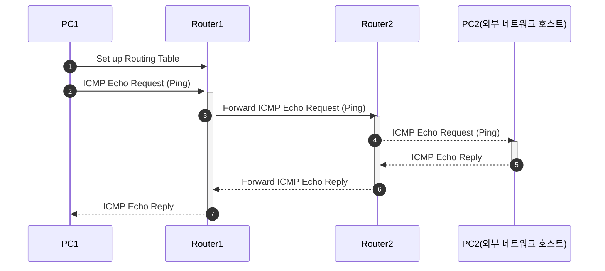
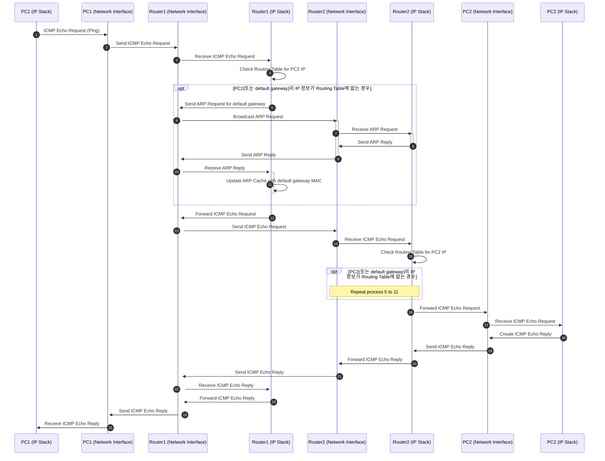

# 프로토콜 스택

# 실습 시나리오
1. 두 대의 PC와 라우터(이번 실습에서는 공유기를 사용)를 준비한다.
2. 라우터 기능을 할 PC(앞으로 Router1이라고 하겠습니다)는 네트워크 연결을 끊는다.
3. 이더넷 케이블을 이용하여 [PC1 - Router1 - Router2] 구조로 연결한다.
4. Router1에서 Static Router 프로그램을 이용해 내부 네트워크와 외부 네트워크를 설정한다.
5. Router1에서 Routing entry에 맞게 모든 항목을 채워서 라우팅 테이블을 채운다.
6. PC1에서 ping 명령어를 이용해 PC2(다른 네트워크 호스트)로 ICMP Echo Request를 전송한다.
7. Router1이 PC1에서 온 ICMP Echo Request 패킷을 받는다.
8. Router1은 Routing Table을 확인하여 패킷의 목적지인 PC2를 찾는다.
[과정]
    - IP 계층에서는 Routing Table 한 열씩 넷마스크와 AND연산을 수행한다.
        - 마스킹 결과와 패킷의 목적지 IP가 일치하면, 대상이 호스트인지 default gateway인지 설정하여 하위 계층(ARP 계층)으로 넘긴다.
        - 마스킹 결과와 패킷의 목적지 IP가 일치하지 않으면 에러 로그를 남긴다.
    - ARP 계층에서는 호스트 또는 default gateway의 IP 주소를 찾기 위해 Proxy ARP Cache Table을 확인한다.
        - Proxy ARP Cache Table에 있으면 ARP 헤더를 작성하여 목적지에 따라 패킷을 호스트 또는 default gateway로 전송한다.
        - Proxy ARP Cache Table에 없으면 ARP Cache Table을 확인한다.
            - ARP Cache Table에도 없으면 ARP Request를 보낸다.
            - 3초 기다렸다가 ARP Reply를 받은 뒤 다시 ARP Cache Table을 확인한다.
            - ARP Cache Table에 호스트 또는 default gateway의 정보가 없으면 에러 로그를 남긴다.
    - ARP Cache Table에 호스트 또는 default gateway의 정보가 있으면 ARP 헤더를 작성하여 목적지에 따라 패킷을 호스트 또는 default gateway로 전송한다.
9. 패킷을 받은 Router2(default gateway)는 Routing Table을 확인하여 패킷의 목적지인 PC2를 찾는다.
    - 8과 동일한 과정을 거친다.
10. PC2는 ICMP Echo Request 패킷을 받아 ICMP Echo Reply 패킷을 생성하여 PC1으로 전송한다.
    - 8과 동일한 과정을 거친다.
11. Router2는 Routing Table을 확인하여 패킷의 목적지로 PC1을 찾는다.
    - 8과 동일한 과정을 거친다.
12. 패킷을 받은 Router2는 패킷을 Router1(default gateway)으로 전송한다.
    - 8과 동일한 과정을 거친다.
13. 패킷을 받은 Router1은 Routing Table을 확인하여 패킷을 목적지인 PC1으로 전송한다.
14. PC1은 ICMP Echo Reply 패킷을 받아 연결이 성공적으로 이루어졌음을 확인한다.

## 실습 시나리오 시퀀스 다이어그램

각 시퀀스에 따른 세부 시퀀스 다이어그램

### PC1 -> Router : ICMP Echo Request (Ping)

## 클래스 다이어그램

  
