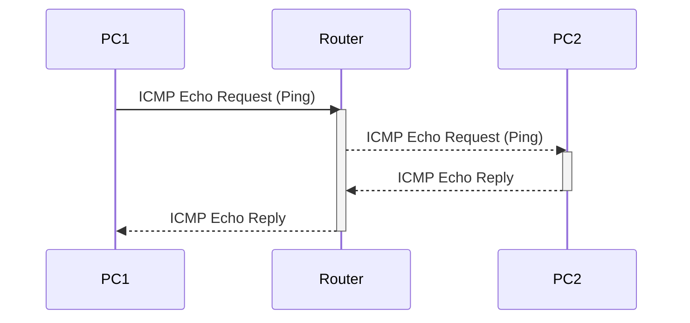
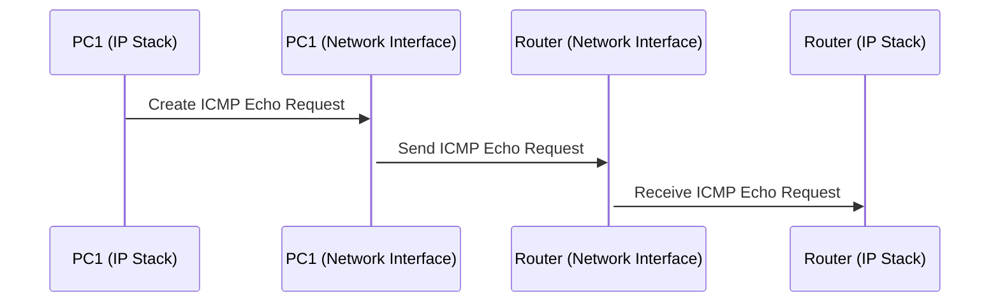
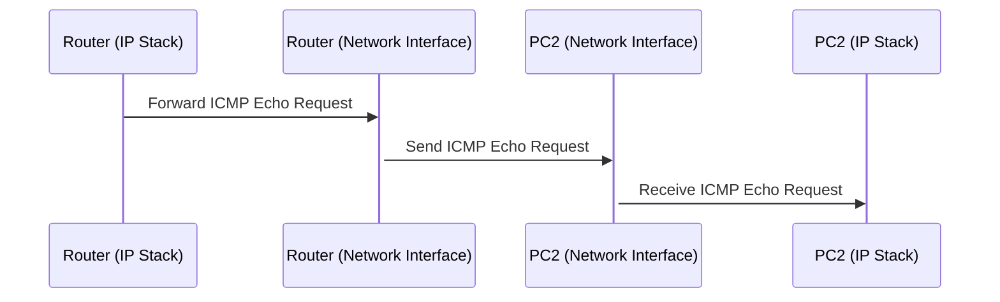
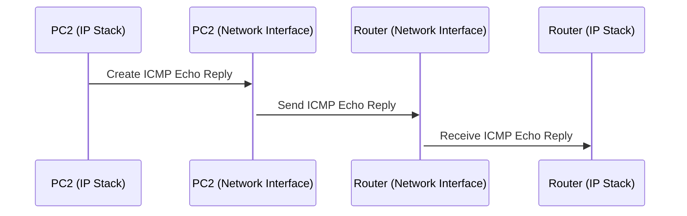
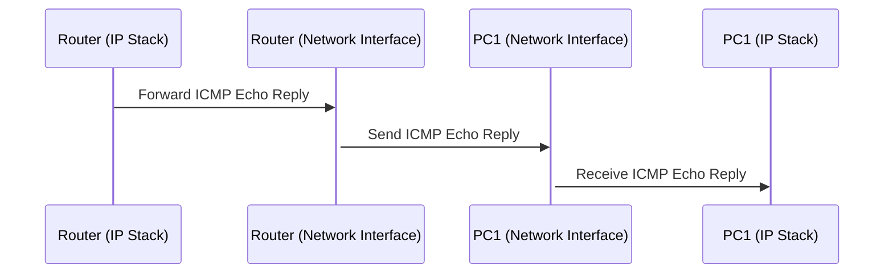

# 2023CN_ARPWithMFC

# 실습 시나리오
1. 두 대의 PC에서 각각 프로그램을 실행한다.
2. 두 대의 PC는 같은 네트워크로 연결한다. (같은 WIFI)
3. ARP Request 및 Reply를 받을 NIC를 선택 및 개방한다.
4. HostA는 Gratuitous ARP란에 수정된 MAC 주소를 입력한다.
5. HostA에서 GARP request를 broadcast로 전송한다.(이 요청에는 출발지의 MAC 주소와 IP 주소, 그리고 목적지의 MAC 주소와 IP 주소가 모두 자신의 것으로 설정되어있음)
6. 이 요청을 수신한 모든 장치(== HostB)는 자신의 ARP 캐시를 업데이트한다.
7. 만약 장치가 이미 해당 IP 주소를 사용하고 있었다면, (== IP 주소 충돌) 이 경우, 해당 장치는 이를 충돌로 인식하고 출발지)에게 GARP reply을 작성한다.
8. HostA에서 GARP reply 패킷을 받았으면 사용자에게 메시지를 보낸다.

## 실습 시나리오 시퀀스 다이어그램

각 시퀀스에 따른 세부 시퀀스 다이어그램

### PC1 -> Router : ICMP Echo Request (Ping)

### Router -> PC2 : ICMP Echo Request (Ping)

### PC2 -> Router : ICMP Echo Reply

### Router -> PC1 : ICMP Echo Reply

# 프로토콜 스택

  
