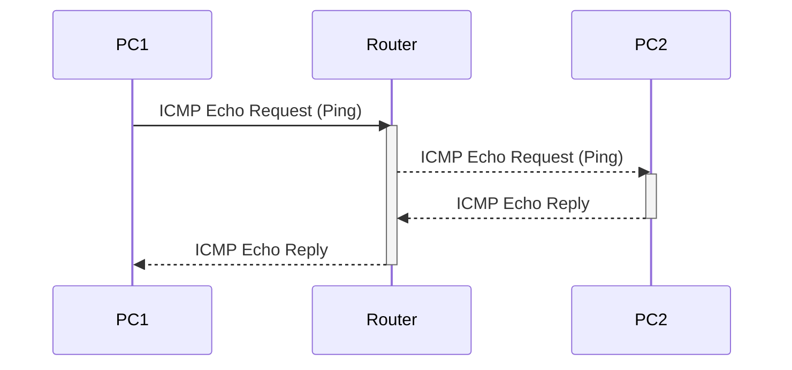
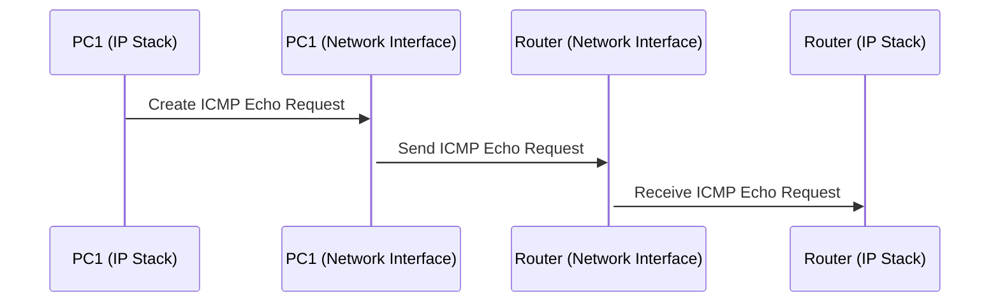
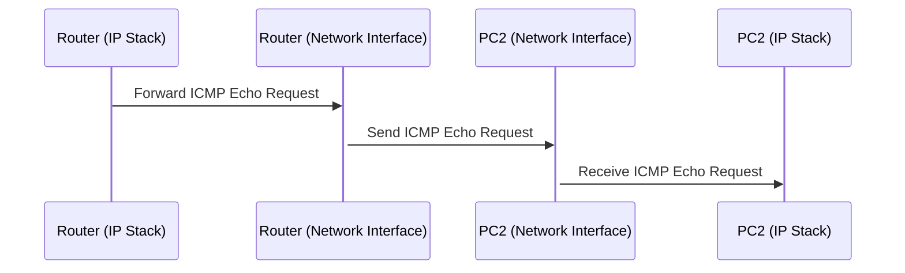
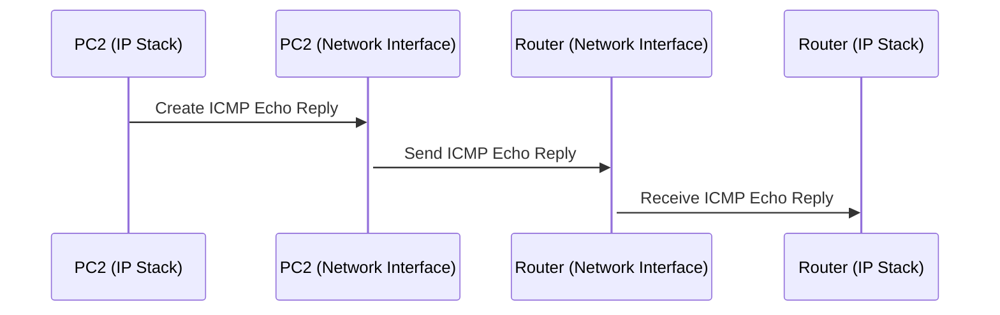
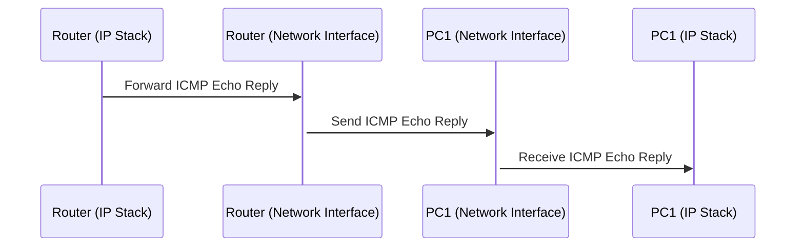

# 프로토콜 스택

# 실습 시나리오
1. 두 대의 PC와 라우터를 준비한다.
2. 두 대의 PC는 각각 라우터와 이더넷 케이블로 연결한다.
3. 각 PC에서 네트워크 인터페이스 카드 (NIC)를 설정한다.
4. 라우터에서 각 PC로 향하는 static route를 설정한다. 이 때, 각 PC의 IP 주소를 목적지로 설정한다.
5. PC1에서 ping 명령어를 이용해 PC2로 ICMP Echo Request를 전송한다.
6. 라우터가 PC1에서 온 ICMP Echo Request 패킷을 받는다.
7. 라우터는 static routing table을 확인하여 패킷의 목적지로 PC2를 찾는다.
8. 라우터는 패킷을 PC2로 전송한다.
9. PC2는 ICMP Echo Request 패킷을 받아 ICMP Echo Reply 패킷을 생성하여 라우터로 전송한다.
10. 라우터는 Static Routing Table을 확인하여 패킷의 목적지로 PC1을 찾는다.
11. 라우터는 패킷을 PC1으로 전송한다.
12. PC1은 ICMP Echo Reply 패킷을 받아 연결이 성공적으로 이루어졌음을 확인한다.

## 실습 시나리오 시퀀스 다이어그램

각 시퀀스에 따른 세부 시퀀스 다이어그램

### PC1 -> Router : ICMP Echo Request (Ping)

### Router -> PC2 : ICMP Echo Request (Ping)

### PC2 -> Router : ICMP Echo Reply

### Router -> PC1 : ICMP Echo Reply

## 클래스 다이어그램

```mermaid
classDiagram
    class CBaseLayer{
        +CBaseLayer(char* pName)
        +~CBaseLayer()
        +SetUnderUpperLayer(CBaseLayer* pUULayer)
        +SetUpperUnderLayer(CBaseLayer* pUULayer)
        +SetUpperLayer(CBaseLayer* pUpperLayer)
        +SetUnderLayer(CBaseLayer* pUnderLayer)
        +GetUpperLayer(int nindex)
        +GetUnderLayer()
        +GetLayerName()
    }
    class CIPLayer{
      +CIPLayer(char* pName)
      +~CIPLayer()
      +void ResetHeader(int iosel)
      +void SetHeaderFields(unsigned char* ppayload, int iosel)
      +unsigned char* GetSourceAddress(int iosel)
      +unsigned char* GetDestinAddress(int iosel)
      +void SetSourceAddress(unsigned char* pAddress, int iosel)
      +void SetDestinAddress(unsigned char* pAddress, int iosel)
      +BOOL Send(unsigned char* ppayload, int nlength, int iosel)
      +BOOL RSend(unsigned char* ppayload, int nlength, unsigned char* gatewayIP, int iosel)
      +BOOL Receive(unsigned char* ppayload, int iosel)
      +void AddRouteTable(unsigned char* _destination_ip, unsigned char* _netmask, unsigned char* _gateway, unsigned char _flag, unsigned char interFace)
      +void DelRouteTable(unsigned char index)
      +void SetDefaultGateway(unsigned char* _gateway, unsigned char _flag, unsigned char interFace)
      +bool LongestPrefix(unsigned char* a, unsigned char* b)
      +void Routing(unsigned char* dest_ip, unsigned char* ppayload, int iosel)
    }
    CIPLayer --|> CBaseLayer : inherits
    class CARPLayer{
      +CARPLayer(char* pName)
      +~CARPLayer()
      +bool Receive(unsigned char* ppayload, int iosel)
      +bool Send(unsigned char* ppayload, int nlength, int iosel)
      +void Wait(DWORD dwMillisecond)
      +bool RSend(unsigned char* ppayload, int nlength, unsigned char* gatewayIP, int iosel)
      +void setmyAddr(CString MAC, CString IP, int iosel)
      +void setType(const unsigned short htype, const unsigned short ptype, int iosel)
      +void setOpcode(const unsigned short opcode, int iosel)
      +void setSrcAddr(unsigned char enetAddr[], unsigned char ipAddr[], int iosel)
      +void setDstAddr(unsigned char enetAddr[], unsigned char ipAddr[], int iosel)
      +void swapaddr(unsigned char lAddr[], unsigned char rAddr[], unsigned char size)
      +void updateTable()
      +void deleteItem(CString IP)
      +std::vector<ARP_NODE> getTable()
      +void clearTable()
      +void createProxy(unsigned char* src, unsigned char* ip, unsigned char* enet)
      +void deleteProxy(const int index)
    }
    CARPLayer --|> CBaseLayer : inherits
    class CEthernetLayer{
        +CEthernetLayer(char* pName)
        +~CEthernetLayer()
        +void ResetHeader(int iosel)
        +unsigned char* GetSourceAddress(int iosel)
        +unsigned char* GetDestinAddress(int iosel)
        +void SetSourceAddress(unsigned char* pAddress, int iosel)
        +void SetDestinAddress(unsigned char* pAddress, int iosel)
        +BOOL Send(unsigned char* ppayload, int nlength, int iosel)
        +void SetType(unsigned short type, int iosel)
        +BOOL Receive(unsigned char* ppayload, int iosel)
    }
    CEthernetLayer --|> CBaseLayer : inherits
    class CNILayer{
        +CNILayer(char* pName)
        +~CNILayer()
        +BOOL Receive(unsigned char* pkt, int iosel)
        +BOOL Send(unsigned char* ppayload, int nlength, int iosel)
        +void SetAdapterComboBox(CComboBox& adapterlist)
        +UCHAR* SetAdapter(const int index, const int iosel)
        +void GetMacAddressList(CStringArray& adapterlist)
        +void GetMacAddress(const int index, UCHAR *mac, const int iosel)
        +void GetIPAddress(CString& ipv4addr, CString& ipv6addr, const int iosel, bool isIOsel)
        +UINT ThreadFunction_RECEIVE(LPVOID pParam)
        +UINT ThreadFunction_RECEIVE2(LPVOID pParam)
        +void Receiveflip()
    }
    CNILayer --|> CBaseLayer : inherits
```

  
